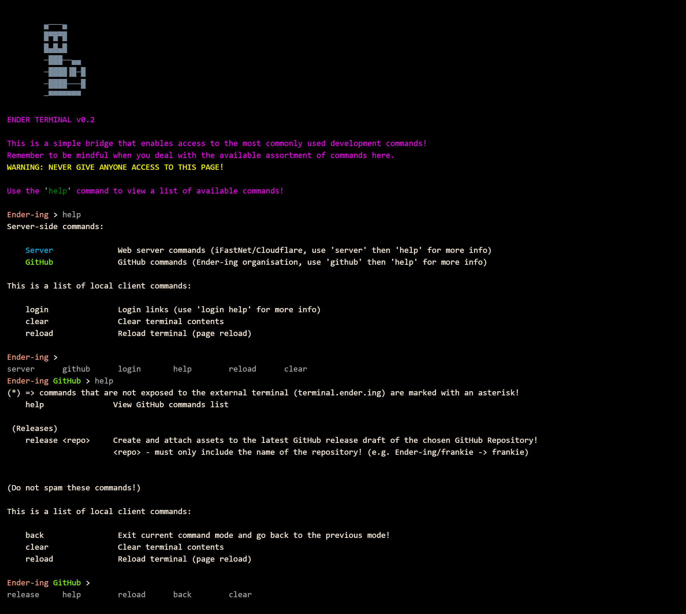

# GitHub Contributions and Updates

In order to contribute to any organisation-owned repositories, you must adhere to the *project's specific requirements*.

If the repository has any GitHub workflows for testing purposes, your pull requests must pass the relevant tests!
In case of a test failure, the pull request will be rejected and closed.

## Server Terminal

:::note
This section is meant to instruct individuals with access to the
[server terminal](https://terminal.ender.ing/) and [private repositories](./intro.md#projects)!
:::

In some cases, you might need to use the custom GitHub server commands in order to initiate certain workflows or actions:

